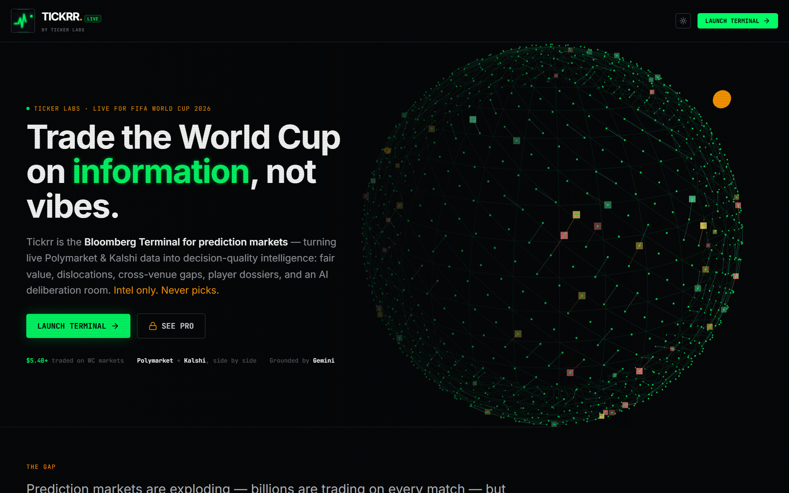
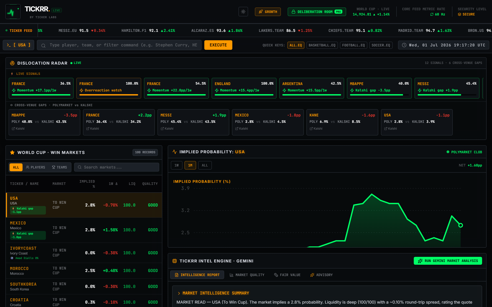
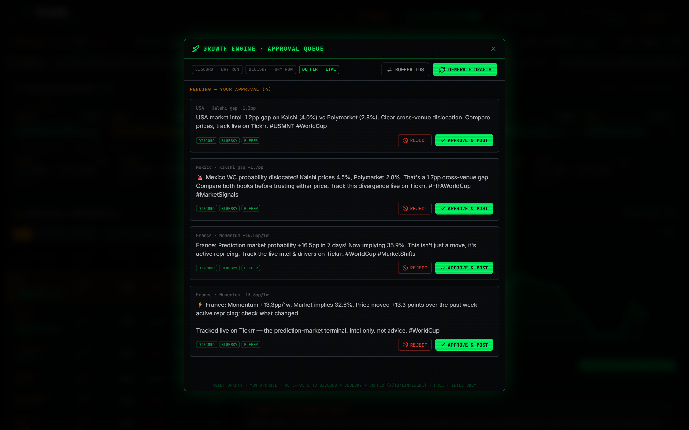

<div align="center">

# ⚡ Tickrr

### Real-time trading analytics for sports markets — the Bloomberg Terminal for sports prediction markets.

[](https://tickrr-web-qqocdd33ra-uc.a.run.app)
&nbsp;
[](https://ai.google.dev)
[](https://github.com/vn-envy/Tickrr/actions)
[](https://cloud.google.com/run)
[](https://cloud.google.com/firestore)
[](LICENSE)

**[🌐 Live terminal](https://tickrr-web-qqocdd33ra-uc.a.run.app) · [▶ 35-sec tour](https://tickrr-web-qqocdd33ra-uc.a.run.app/promo/) · [🔌 API docs](https://tickrr-api-qqocdd33ra-uc.a.run.app/docs) · [🚀 Deploy guide](docs/DEPLOY.md)**



</div>

---

Tickrr turns live sports-market data into **decision-quality intelligence** — fair-value ranges,
dislocation detection, cross-venue divergence, player dossiers, and cited "why did it move?"
explanations — delivered as a dense, fast terminal, plus an API and an MCP layer so AI agents can
consume the same signals.

We launched on the **FIFA World Cup 2026** — the highest-volume, most-volatile sports-trading event
on the calendar and the perfect proving ground. From there Tickrr follows the money: it **expands
to global sporting events based on where trading interest and capital flow next**, re-pointing the
same engine at the leagues and tournaments with the most volume and volatility.

**▶ Now live: the NFL.** The terminal already covers **both** — live World Cup markets *and* **NFL
2026-season futures** — because the NFL is the next spectacle the money is flowing to (~40% of
Polymarket sports volume; Super Bowl LX was the single largest sporting event in Polymarket
history at $701M, and Kalshi traded $2.8B in that week). Adding an event is one config value
(`VITE_MARKET_QUERIES` for the terminal, `GROWTH_QUERIES` for the autonomous growth engine) — no
code change — so the engine chases each spectacle as it heats up.

> **Intel only.** Tickrr never tells you to bet, buy, sell, or size a position, and it never
> executes trades. It tells you whether a price is decision-quality — and why it moved.

Built for the **Build with Gemini XPRIZE** (category: Professional Services), powered by **Gemini**
and running on **Google Cloud**.

---

## The terminal

A Bloomberg-style, dark, dense, real-time workspace: a **Dislocation Radar**, cross-venue
win-markets screener, live implied-probability charts, player dossiers, and a **Gemini-powered
intelligence panel** that explains every move with grounded sources.



| Capability | What you get |
|---|---|
| **Dislocation Radar** | Live edge signals — momentum, overreaction, thin-book/liquidity traps — ranked by severity the moment they appear. |
| **Cross-Venue Divergence** | Polymarket vs Kalshi vs the **sportsbook consensus** (DraftKings, FanDuel, Pinnacle & ~40 books via The Odds API, de-vigged) on the *same* outcome — the gaps computed so you see which crowd is mispriced. |
| **Fair Value** | Every market normalized to a comparable probability with a liquidity- and spread-aware fair range. |
| **Player Dossiers** | Per-player tickers (Golden Boot, to-score, assists) mapped to national teams, plus a live Wikipedia attention signal. |
| **Real Price History** | Implied-probability charts straight from the Polymarket CLOB. |
| **Deliberation Room** *(Pro)* | Two grounded Gemini experts argue your stance — one for, one against — facts only. |
| **"Why it moved" intel** | Gemini + Google Search grounding explains market moves with citations. |

---

## The autonomous growth engine (removed from prod — opt-in)

> **Not deployed in production.** The growth agent is disabled by default: its entire
> `/api/growth/*` surface only mounts when `GROWTH_ENABLED=1` is set, `deploy.sh` no longer
> ships its credentials or Cloud Scheduler job (and tears down the legacy `tickrr-autodraft`
> job), and the Growth Console has been removed from the terminal UI. Run it locally or on a
> separate private ops deployment if you want it.

Tickrr can market itself with a **human-in-the-loop** agent. On a schedule it drafts posts from live
market signals; you approve with one tap; approved posts auto-publish — with a **branded video or
screenshot of the live terminal attached**.



```
Cloud Scheduler (9am & 5pm ET)
      │
      ▼
agent drafts from live signals ──▶ Firestore approval queue ──▶ founder ping (Discord)
      │
      ▼   ✋ you approve in the console
      ▼
record live terminal → ffmpeg (fade · TICKRR wordmark · "intel only" lower-third · audio) → MP4 on GCS
      │
      ▼
auto-post to  X · LinkedIn · YouTube  (via Buffer, free tier)
```

Everything except your approval tap is automated — and the whole loop runs on free tiers. Drafts
are generated from real dislocation/divergence signals and are **intel-only** by construction.
Media captures are **real screenshots/recordings of the live app** (Playwright + ffmpeg, zero AI
cost); an AI-video hook (Veo / HeyGen) is scaffolded and gated for when you choose to spend.

---

## Architecture

Monorepo, two Cloud Run services:

| Path | Role |
|---|---|
| `backend/` | **Python · FastAPI** — the intelligence engine: data ingestion, fair-value, dislocation & divergence detection, player index. Serves the read API. |
| `web/` | **Vite · React 19 · Tailwind v4 · Express** — the terminal UI + a Node server that fronts Gemini, Razorpay, the growth engine, and proxies market data (browser stays same-origin: no CORS). |
| `docs/` | Deploy + operations guides. |

**Data (derived analytics only):** Polymarket (Gamma + CLOB, primary) · Kalshi (derived cross-venue
analytics + attributed link-out only, per their Data ToS) · Wikimedia pageviews (attention signal).

**Google-native stack:** **Gemini** (`gemini-2.5-flash`, Google Search grounding) for intel, the
Deliberation Room, and post copy · **Cloud Run** (two services) · **Firestore** (durable approval
queue) · **Cloud Scheduler** (autonomous cadence) · **Cloud Storage** (media hosting) ·
**Cloud Build** (source deploys).

---

## Run it

**Live:** **[tickrr-web-qqocdd33ra-uc.a.run.app](https://tickrr-web-qqocdd33ra-uc.a.run.app)** · one-command deploy in **[docs/DEPLOY.md](docs/DEPLOY.md)** (`bash deploy.sh`) · **CI/CD** auto-deploys each service on push to `main` ([docs/CICD.md](docs/CICD.md)).

**Local:**
```bash
# backend (Python 3.11+)
cd backend && python -m venv .venv && . .venv/Scripts/activate && pip install -r requirements.txt
uvicorn app.main:app --port 8000

# web (Node 20+), in another shell
cd web && npm install && cp .env.example .env && npm run dev   # http://localhost:3000
```
Everything runs in free/demo mode without keys; see `web/.env.example` for optional integrations
(Gemini, Razorpay, Discord/Bluesky/Buffer publishing, Firestore, media).

---

## API surface

**Backend** — `GET /api/markets`, `/api/dislocations`, `/api/history`, `/api/player`, `/healthz`.
**Web** — `POST /api/insights`, `/api/deliberate`; billing `GET /api/plans`, `POST /api/checkout`;
growth (opt-in, `GROWTH_ENABLED=1` only — absent in prod) `GET /api/growth/{drafts,health,buffer/channels}`,
`POST /api/growth/{generate,cron,drafts/:id/:action}`.

---

## Legal & responsible use

Tickrr provides **informational market analytics only**. It is **not** financial, investment, or
betting advice, and it does **not** execute trades. Prediction markets involve risk; 18+/21+ where
applicable. Kalshi data is used for derived analytics and attributed link-out only.

## License

[Apache License 2.0](LICENSE) © Kritxlabs. Bundled font: JetBrains Mono ([OFL](web/assets/fonts/OFL.txt)).
